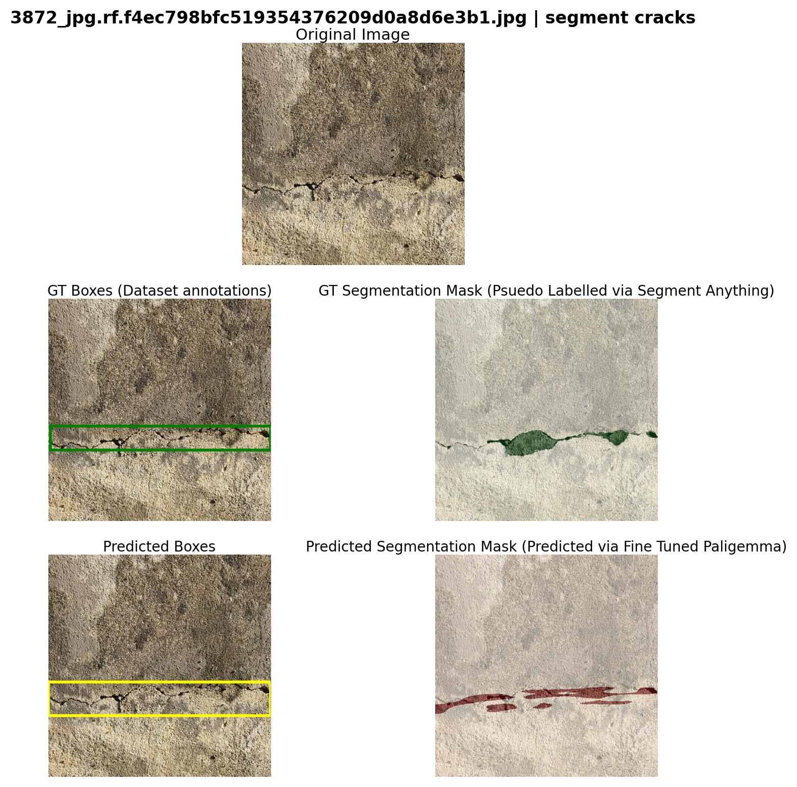
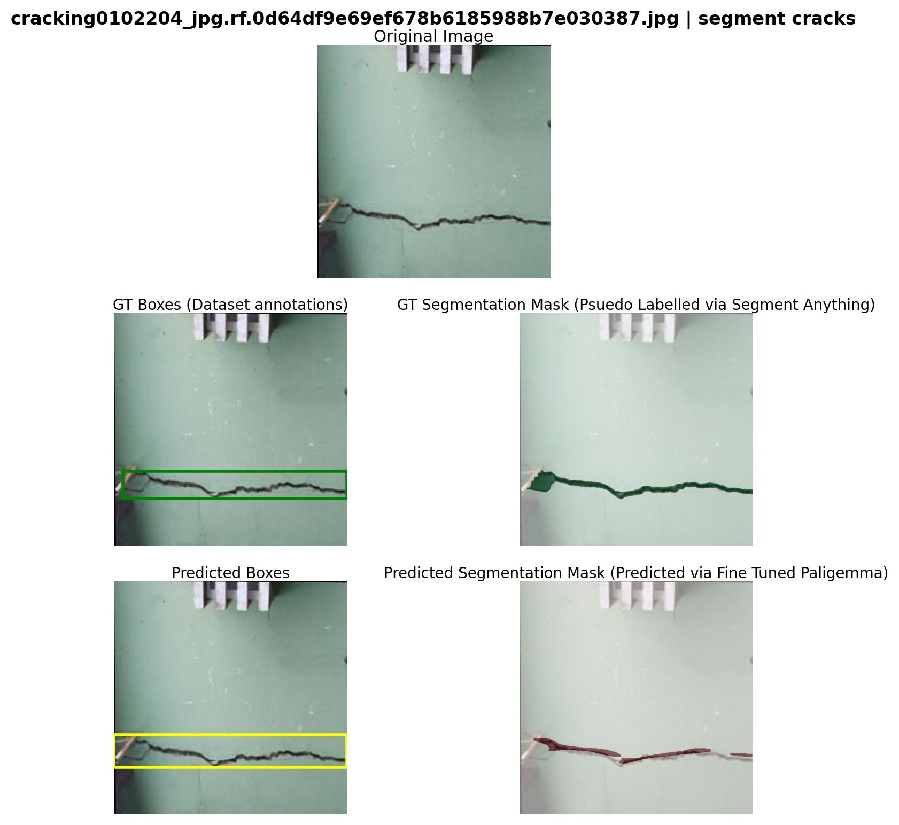
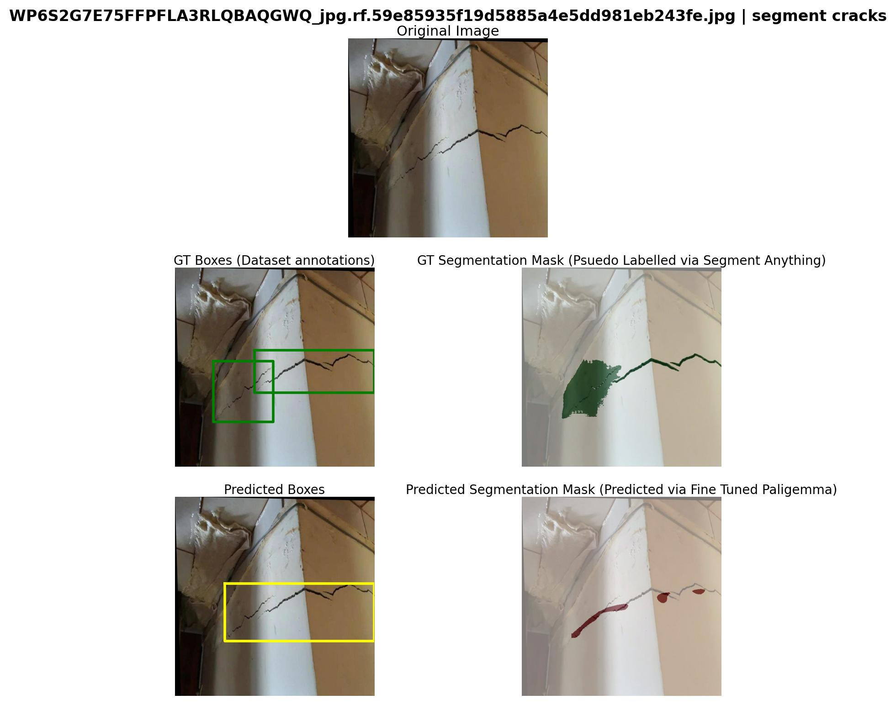
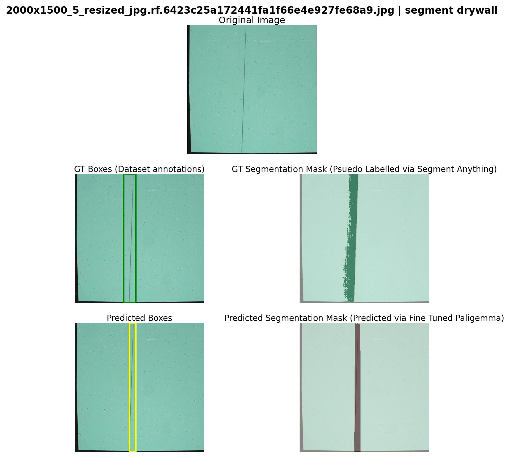
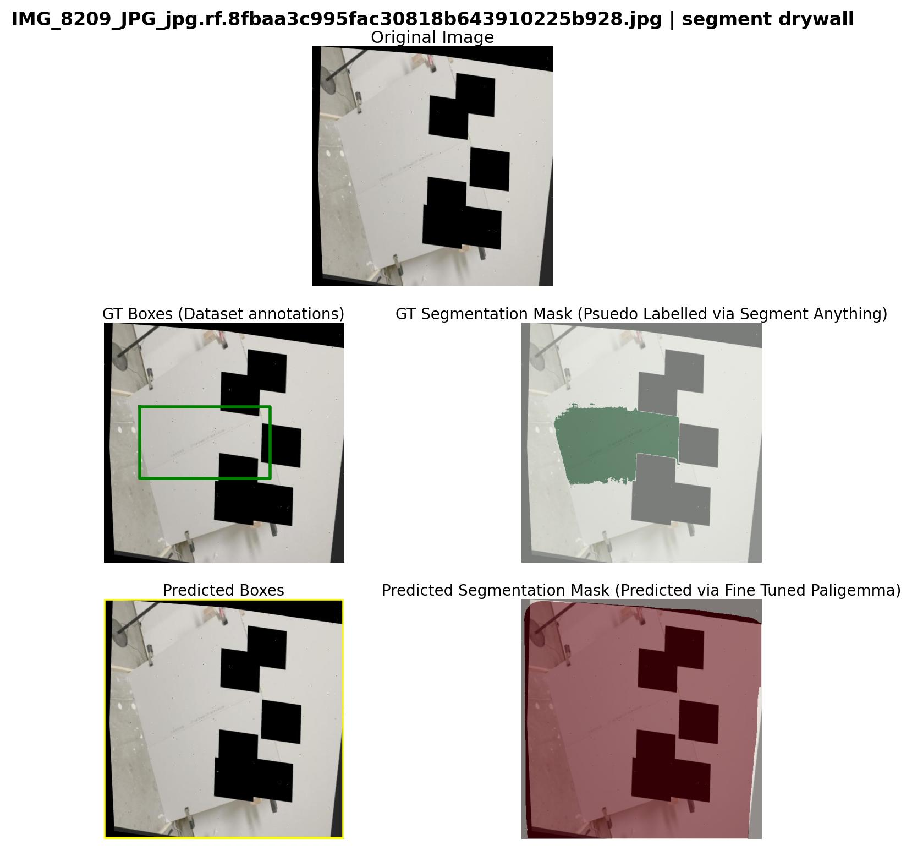
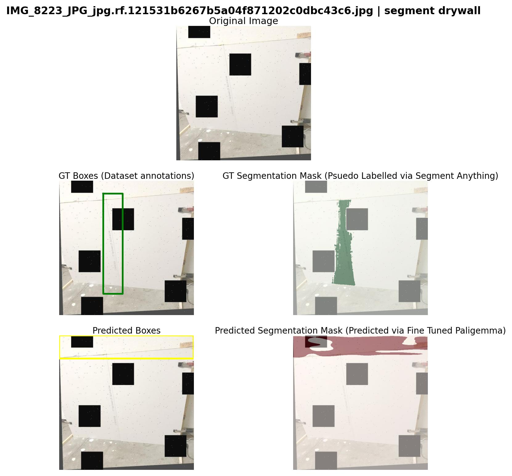

## Prompt-based Segmentation (Cracks and Drywall taping)

### Task

The task requires fine tuning a text-conditioned segmentation model which outputs binary mask

### Inputs

MODEL (IMAGE + User Prompt) --> Bounding box + Segmentation mask (0, 255)

### Datasets
- Dataset 1 (Taping area):
https://universe.roboflow.com/objectdetect-pu6rn/drywall-join-detect

Prompt Prefix: “segment drywall”

- Dataset 2 (Cracks): https://universe.roboflow.com/fyp-ny1jt/cracks-3ii36
Prompt prefix: “segment cracks”

### Model used and Fine Tuned

- `google/paligemma-3b-mix-224`

### Training setup:

- `NVIDIA RTX 4090 (25 GB VRAM)`

### Running this project

- `git clone https://github.com/sagelens/robot-qa.git` (Clone repo)
- `cd robot-qa` (change work dir to robot-qa)
- `bash setup_env.sh` (setup conda envirionment (vlm))
- `bash setup_models.sh` (download SAM, BigVision VAE and Paligemma-mix-224 checkpoints to work dir)
- Download Datasets and extract in robot-qa dir (manually)
- `https://drive.google.com/file/d/1anu_A8TNztIgszI54o3S5Hg-rWA8amXT/view?usp=drivesdk` > robot-qa/drywall/
- `https://drive.google.com/file/d/1rcuOcHU6oyn5YiLql31U_foenHOUwKwM/view?usp=drivesdk` > robot-qa/cracks/
- `https://drive.google.com/file/d/1X8LynmOEmwXCmeC6UBJ46ASs9R8JwQFB/view?usp=drivesdk` > robot-qa/all_data/ (This is our OUT DIR and contains metrics and annotations (both GT and Predicted))

- `conda activate vlm`
- `python src/convert_cracks.py` (Converts cracks dataset to Paligemma annotations)
- `python src/convert_drywall.py` (Converts drywall dataset to Paligemma annotations)
- `python src/tune_paligemma.py`  (Fine tuning script)
- `python src/infer_paligemma_all_ckpts.py` (Inference on all saved QLORA checkpoints)
- `python src/infer_paligemma_best_ckpt.py` (Inference on best QLORA checkpoint (50th step))
- `python src/save_predictions.py` (Save all TRAIN and VALID predictions, masks and bboxes)
- `python src/collect_evals.py` (Evaluate DICE and IOU metrics for all predictions and run statistics)
- `python src/save_visualizations.py` (Plots sample results (Original | GT Mask | Predicted Masks))

### Approach

- Both datasets provide raw RGB images (640, 640) and detection bounding boxes.
- Exported images and annotations from RoboFlow for both datasets (cracks, drywall) as JSONL files.
- Since dataset has no pre-labelled annotations for segmentation masks (pixel-level). Using the bounding boxes annotations I ran Segment Anything model to obtain high quality pixel masks for each given RGB image and bounding box (this uses src/convert_cracks.py and src/convert_drywall.py)
- After obtaining pixel maps I saved them as ground truth segmentation masks (pseudo labels) for each image in train and valid splits.
- For each object, I generate location tokens by normalizing its bounding box coordinates relative to the image size, then binning these 0-to-1 values into 1024 discrete integer IDs, which are mapped to four <loc> tokens.

Simultaneously, I generate segmentation tokens by cropping the mask to the bounding box, resizing this crop to a fixed 64x64, and using a pre-trained encoder ("vae-oid.npz") to convert this visual patch into a sequence of <seg> tokens.

These two token strings are then concatenated together, followed by the object's class name (e.g., <loc####><seg####> cracks).

If there are multiple objects, each object's full string is joined by a " ; " separator to create the final, complete output string.

- The token strings were saved as suffixes for downstream fine tuning of Paligemma. I also normalised prefix strings to follow either `segment cracks` or `segment drywall`.

- All annotations were saved to `_annotations.{SPLIT}.jsonl`. For both TRAIN and VALID splits. Example annotation: 
```text
{"image": "409-dat_png_jpg.rf.2ee6f2973adaf6d0f45c6a435d765671.jpg", "prefix": "segment cracks", "suffix": "<loc0000><loc0360><loc1004><loc0440><seg041><seg041><seg064><seg103><seg004><seg068><seg060><seg038><seg019><seg041><seg057><seg022><seg099><seg049><seg019><seg074> crack"}
```

- After this I ran `src/tune_paligemma.py` to fine tune the base `google/paligemma-3b-mix-224` with below settings.

LORA Config:
```python
lora_config = LoraConfig(
        r=8,
        lora_alpha=16,
        lora_dropout=0.05,
        bias="none",
        task_type="CAUSAL_LM",
        target_modules=["q_proj","k_proj","v_proj","o_proj","gate_proj","up_proj","down_proj"],
    )
```
- Initial Learning rate: 5e-5
- Save steps: 25 (saved LORA checkpoints after each 25 training steps)
- Batch size: 2
- Weight decay: 0.01
- Warmup ratio: 0.03
- Gradient accumulation: 8
- Seed: 42

I trained the model for 1 epoch initially, later I figured the model decoding performance being degraded as we overfit. I evaluated model performance (decoding token generation) on each of the saved checkpoints and found the best performance on 50th steps checkpoint. This was used to final predicted box, mask generation and IoU and Dice calculations.

- The paligemma output strings were decoded into binary segmentation mask using `src/tok_to_mask`
- The decoded text from PaliGemma contains <loc> (bounding box) and <seg> (16-token VQ-VAE code) tags for each object instance.
- These <seg> tokens are fed into a pretrained VAE decoder (vae-oid.npz), which reconstructs a low-resolution 64×64 grayscale mask in [0, 1].
- The mask is then resized and thresholded inside the corresponding <loc> bounding box to create a full-resolution binary mask over the input image.
- All per-instance masks are aggregated (unioned) per label, yielding one or more binary segmentation maps aligned with the original image.

I saved predicted masks and predicted suffix from Paligemma output to `predicted_masks/` and `_annotations.predicted{SPLIT}.jsonl` for both TRAIN and VALID splits.

At last I used `src/collect_evals.py` and `src/metrics.py` to evaluate the metrics on both TRAIN and VALID splits for each prompts seperately.

### Results

#### Train vs Validation Metrics

| Segment Type | Metric Type  | Train mIoU | Train mDice | Valid mIoU | Valid mDice |
| ------------ | ------------ | ---------- | ----------- | ---------- | ----------- |
| Cracks       | Segmentation | 0.2381     | 0.3338      | 0.2745     | 0.3723      |
| Cracks       | Bounding Box | 0.6139     | 0.6935      | 0.5998     | 0.6688      |
| Drywall      | Segmentation | 0.0905     | 0.1486      | 0.0916     | 0.1541      |
| Drywall      | Bounding Box | 0.1462     | 0.2353      | 0.1525     | 0.2471      |

#### mIoU consistency statistics

| Statistic          | Train           | Validation      |
| ------------------ | --------------- | --------------- |
| Mean               | 0.2180          | 0.1826          |
| Std Dev            | 0.2291          | 0.2171          |
| Min-Max            | 0.0000 – 0.9938 | 0.0000 – 0.9929 |
| P10                | 0.0103          | 0.0091          |
| P50                | 0.1336          | 0.0971          |
| P90                | 0.5632          | 0.5293          |
| Cracks mIoU ± Std  | 0.2381 ± 0.2356 | 0.2745 ± 0.2600 |
| Drywall mIoU ± Std | 0.0905 ± 0.1198 | 0.0916 ± 0.1011 |
---

### **Segmentation Visuals**

Sample qualitative results visualizing segmentation outputs from the model.
Each image corresponds to either **crack** or **drywall** segmentation.

#### **Cracks Segmentation**





#### **Drywall Segmentation**






### Failure Notes & Improvement Directions

#### Identified Issues

The model demonstrates reasonable visual segmentation quality, but quantitative metrics (IoU and Dice scores) remain suboptimal due to several factors:

**Data Quality Issues**
- SAM pseudo-labeling produces inconsistent pixel-level annotations, even with correct bounding boxes
- Noisy ground truth masks propagate errors during training and evaluation

**Class Imbalance**
- Significantly less drywall data compared to cracks dataset
- Drywall mIoU (0.09) substantially lower than cracks mIoU (0.27)

**Lighting Variability**
- Drywall images exhibit inconsistent lighting conditions
- Model struggles to generalize across different illumination scenarios

#### Directions for Improvements

**1. Pseudo-Label Quality**
- Review and correct SAM-generated masks for a subset of images
- Use multiple SAM prompts (points + boxes) for more accurate segmentation
- Apply morphological operations to clean masks and define countors

**2. Data Imbalance**
- Apply data augmentation (brightness, contrast, color jittering) specifically for drywall samples
- Use class-weighted loss during training to balance crack vs. drywall learning

**3. Training Strategy**
- Resume training from checkpoint-50 with lower learning rate (1e-5 to 2e-5)
- Increase LoRA rank (r=16 or r=32) for better model capacity
- Train for longer with early stopping based on validation metrics

**4. Post-Processing Refinements**
- Apply conditional random fields (CRF) to refine mask boundaries


### Runtime metrics

1. Train time: # TODO

2. Inference time (per image): # TODO

3. Model size: # TODO

